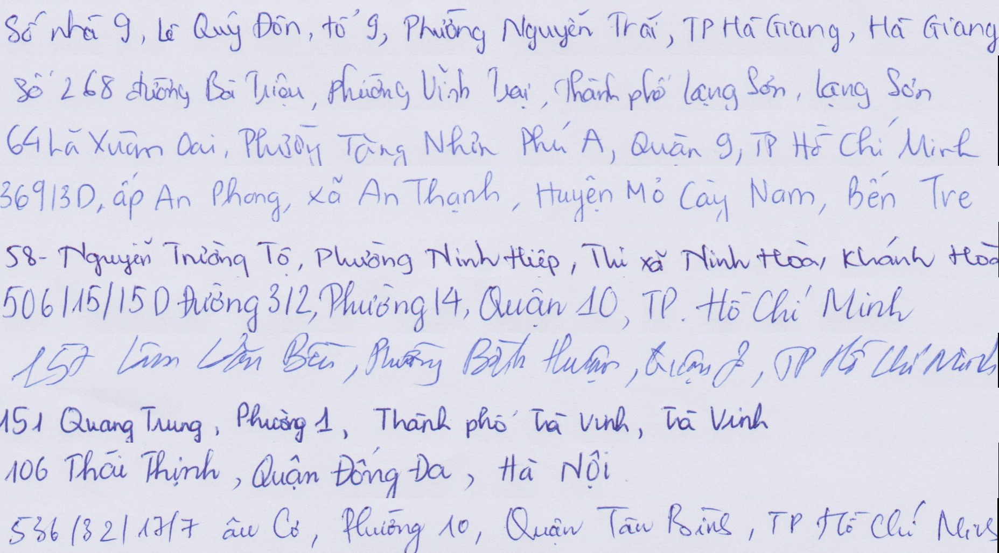
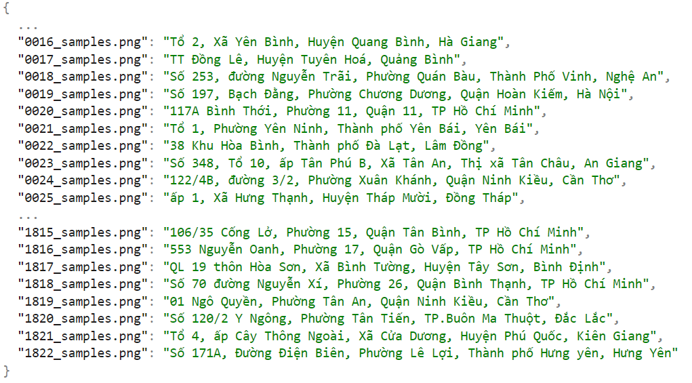

# Vietnamese-Handwriting-Recognition
This is my prethesis project where i use what i learn to make a model that can read Vietnamese handwritten as image input and process to read them
using CRNN(CNN + RNN) model implemented by Tensorflow 
# Here's what im gonna do:
* Find all widths and heights of images
* Use openCV to read image
* Preprocess images (like converting images to greyscale)
* Resize images so all images will have the same size
* Split your dataset into trainset and testset
* Build CRNN model with CTC loss
* Prediction
* Calculate metrics for SER, WER and CER
# Data preprocessing
Data used in this code are downdload [here](https://drive.google.com/file/d/15ULMGkXxPRadFOqUs1-7BUiZv-_QNpGx/view?usp=sharing)

The dataset include 1838 images and its label are stored in json file, which is provided by Cinnamon AI.

Here is thefirst look of the raw data

Its label structure in json file

Our pipeline

The tradition method of OCR is using CNN where we crop each leter and use them to train our model, however this method have many flaws:
* It cannot predict long sequence text
* Time consuming
* Expensive

In this project, I use the CRNN model which is the combination of CNN, RNN and CTC loss for image-based sequence regconition goal which is perfect in this scenario.
By using CRNN instead of normal CNN, we can shorten the time needed for training and also increase accuracy.
The image will be sliced base on the time step that we define in the RNN step and will be decoded later on using CTC loss function

# Result
The training process took me around 2 hours with 15.8123 loss

By analyzing the loss, i can calculate the most 3 import metrics for text-based regconition task
* CER (Character error rate): 
* WER (Word error rate):
* SER (Sequence error rate): 

